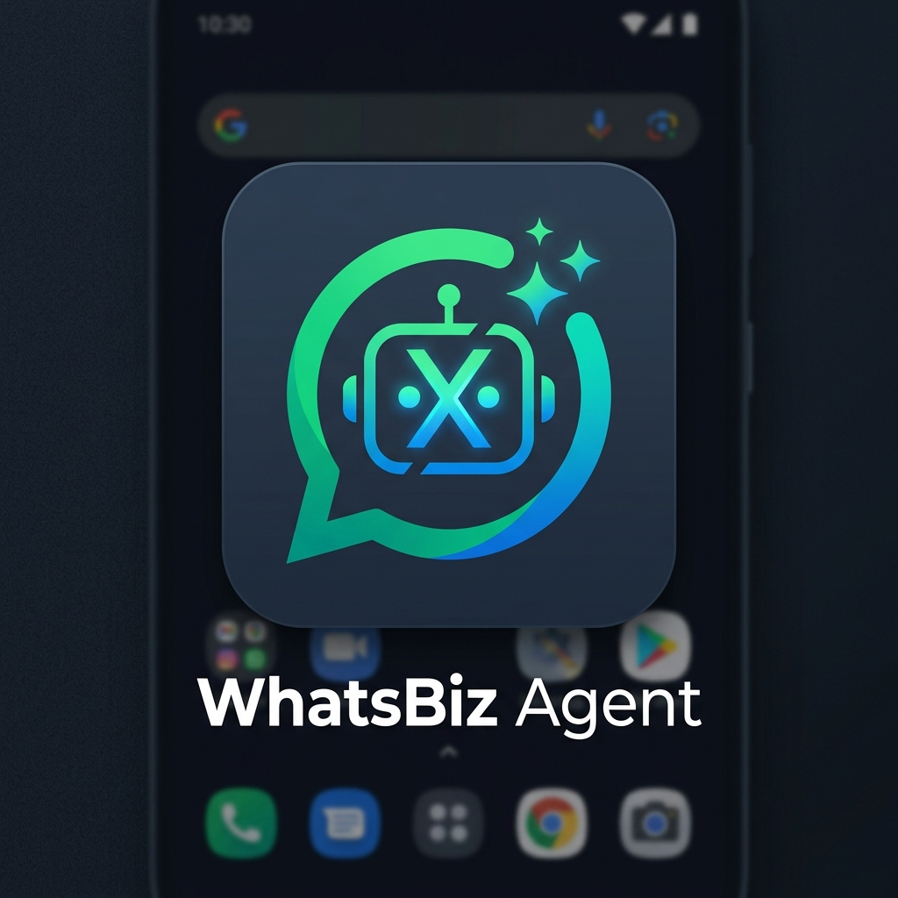
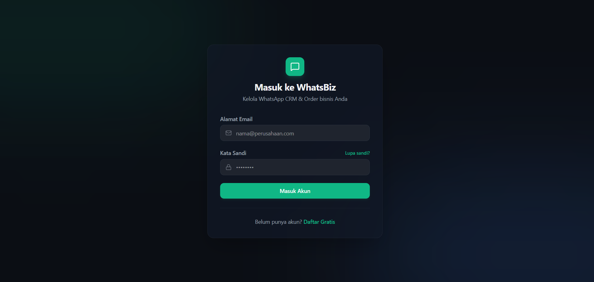
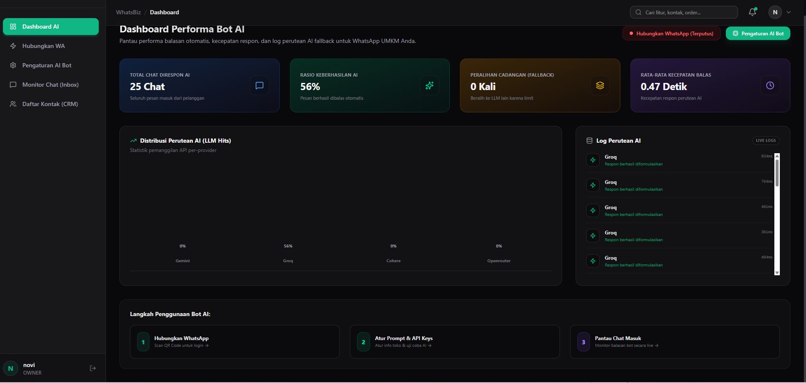
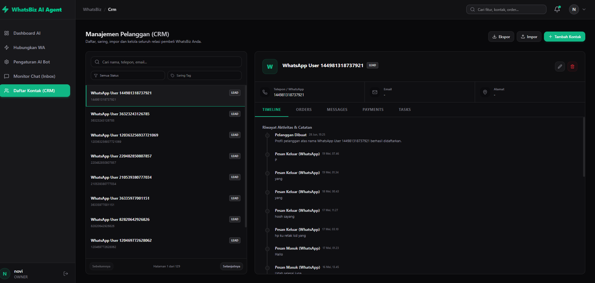
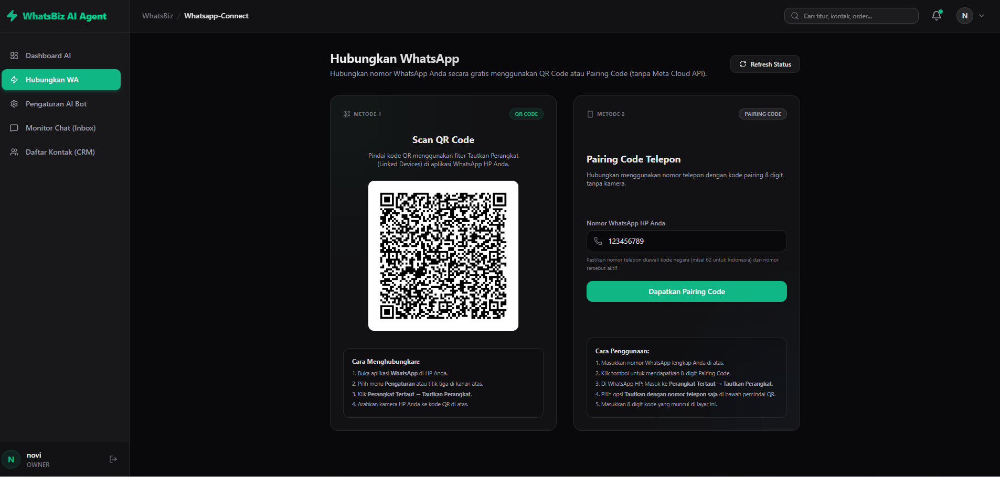
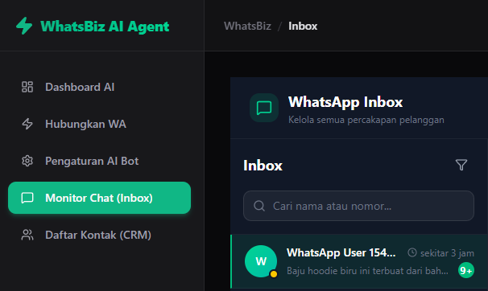
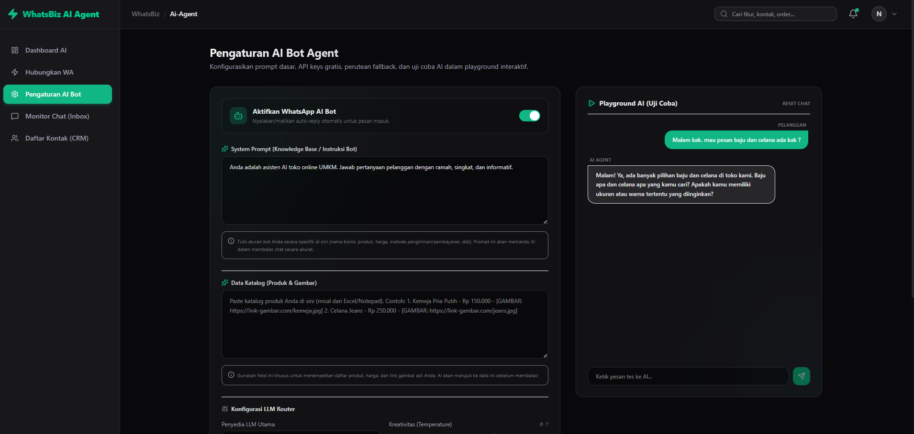

<div align="center">
  
  <h1>WhatsBiz Agent (SaaS CRM)</h1>
  <p><strong>Platform CRM WhatsApp Pintar dengan Multi-AI Agent & Image Generator untuk UMKM</strong></p>
</div>

---

## 🌟 Tentang Aplikasi
**WhatsBiz Agent** adalah solusi All-in-One CRM WhatsApp yang dirancang khusus untuk membantu UMKM melayani pelanggan secara otomatis 24/7. Aplikasi ini menggunakan teknologi AI canggih dari **Gemini, Llama (Groq), Cohere, dan OpenRouter** yang dapat saling mem- *backup* (Auto-Fallback) jika salah satu layanan sedang limit.

Tidak hanya membalas teks, AI kami dapat membagikan **Katalog Produk** secara akurat dan secara ajaib **Menciptakan Foto Produk** (Image Generation) langsung di dalam chat WhatsApp!

## ✨ Fitur Unggulan

- **🤖 Multi-AI Fallback System**: Dukungan Gemini, Groq, Cohere, dan OpenRouter. Jika satu AI limit/down, sistem otomatis melompat ke AI berikutnya tanpa disadari pelanggan.
- **📱 Multi-Device & LID Support**: Kompatibel dengan fitur terbaru WhatsApp (Linked Devices). Balasan AI 100% tepat sasaran ke nomor pengirim.
- **📸 Auto Image Generator**: Bot dapat menciptakan visual produk langsung di dalam chat WA berdasarkan deskripsi menggunakan integrasi Pollinations AI (dengan proteksi *no human/no hands* agar gambar bersih).
- **🛍️ Katalog Injeksi**: AI membaca data katalog (harga, stok, link e-commerce) milikmu dan menjadikannya referensi utama sebelum berimajinasi menjawab pertanyaan.
- **📱 Android App (WebView)**: Dilengkapi dengan aplikasi Android (.apk) *native* agar admin toko bisa memonitor *dashboard* dari genggaman.
- **🔒 Multi-Tenant SaaS**: Mendukung banyak akun pengguna/toko di dalam satu database menggunakan JWT Authentication.

---

## 📸 Dokumentasi & Antarmuka Aplikasi

Berikut adalah sekilas tampilan dari platform **WhatsBiz**:

### 1. Halaman Login & Dashboard Utama
<div align="center">
  
  &nbsp;&nbsp;&nbsp;
  
</div>
<br/>

### 2. Manajemen Kontak & Menghubungkan WhatsApp
<div align="center">
  
  &nbsp;&nbsp;&nbsp;
  
</div>
<br/>

### 3. Monitor Chat 
<div align="center">
  
</div>
<br/>

### 4. Demo Kemampuan AI 
AI kami tidak hanya cerdas menjawab pertanyaan berdasarkan katalog, tetapi juga bisa memvisualisasikan produk (contoh: kaos polos) langsung di WhatsApp pengguna.
<div align="center">
  
</div>

---

## 🛠️ Teknologi yang Digunakan
- **Frontend:** Next.js 14, TailwindCSS, Axios
- **Backend:** NestJS, TypeScript, Prisma ORM
- **Database:** PostgreSQL (Neon DB)
- **WhatsApp Engine:** Baileys (MD)
- **Android App:** Kotlin (WebView Wrapper)

## 🚀 Panduan Instalasi Lokal

1. **Clone repository ini:**
   ```bash
   git clone https://github.com/username/whatsbiz-agent.git
   cd whatsbiz-agent
   ```

2. **Setup Backend:**
   ```bash
   cd backend
   npm install
   # Sesuaikan .env dengan kredensial PostgreSQL kamu
   npx prisma generate
   npx prisma db push
   npm run start:dev
   ```

3. **Setup Frontend:**
   ```bash
   cd ../frontend
   npm install
   npm run dev
   ```

4. Buka browser di `http://localhost:3000` dan daftar sebagai tenant baru!

---

<div align="center">
  Dibuat dengan ❤️ untuk kemajuan UMKM.
</div>

